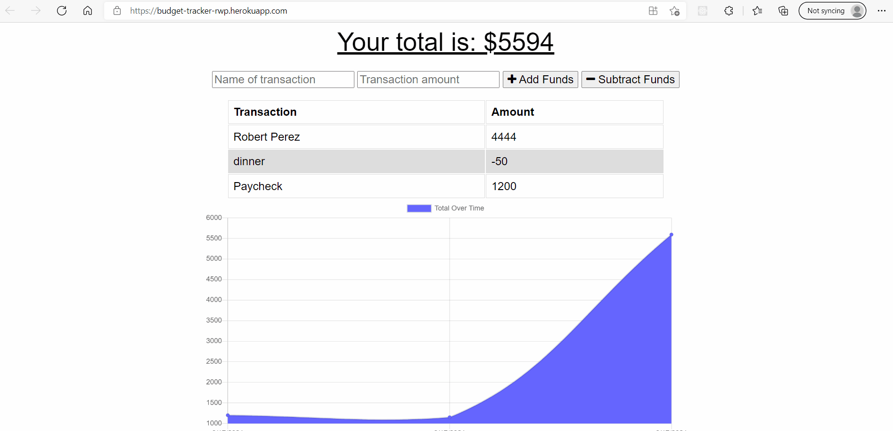

# Budget-Tracker-PWA

## Description

A PWA that allows users to track their expenses by adding or subtracting funds from their balance.

The code and all relevant files can be found at [github.com/perez-rob/Budget-Tracker-PWA](https://github.com/perez-rob/Budget-Tracker-PWA).

The deployed application can be accessed here: [budget-tracker-rwp.herokuapp.com/](https://budget-tracker-rwp.herokuapp.com/)

## Table of Contents

- [Installation](#installation)

- [Features](#features)

- [Credits](#credits)

- [Questions](#questions)

- [License](#license)

## Installation

No installation required. Just go to [budget-tracker-rwp.herokuapp.com/](https://budget-tracker-rwp.herokuapp.com/) to use.

## Features

The Budget Tracker has the following features:

- Transaction data are stored in a remote MongoDB
- All essential files and data are cached via service-worker.js for offline access
- Transactions logged while offline are stored in IndexedDB until connection allows them to be uploaded.
- Webpack bundled JS files save space and load time

## Credits

Solo project for GATech Coding Bootcamp. Starter good for the UI was provided.
by Rob Perez

- [Portfolio Page](https://www.robperez.net)
- rob@robperez.net
- 404.317.5336

## Questions

If you have any questions about the repo, open an issue or contact me directly at bob.w.perez@gmail.com. You can find more of my work at [github/perez-rob](https://github.com/perez-rob).

## License

This project is licensed under the [GPL v3 License](https://www.gnu.org/licenses/gpl-3.0).
